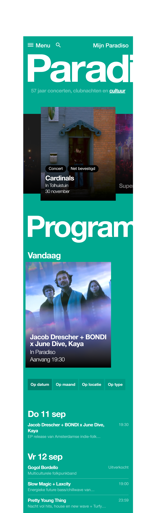
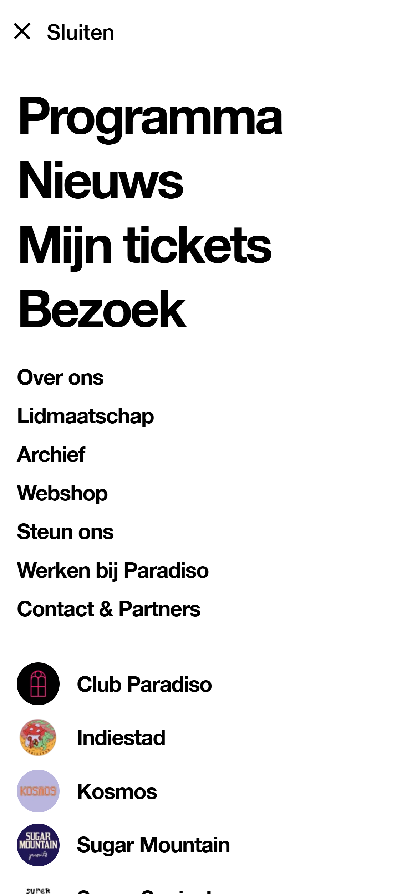
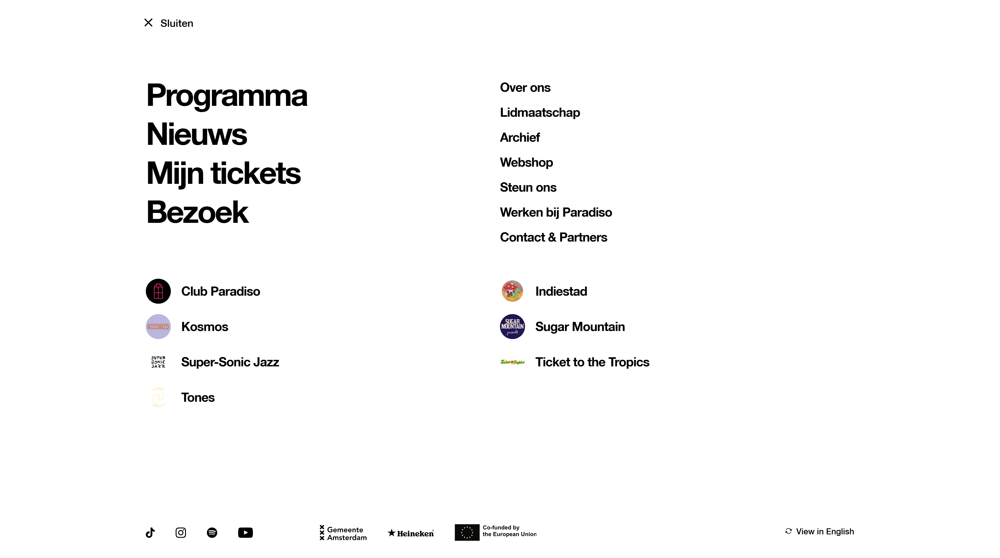
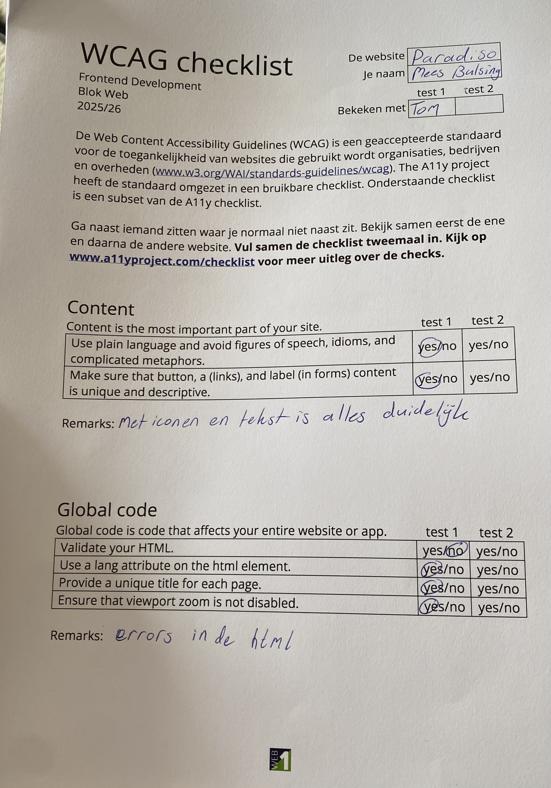
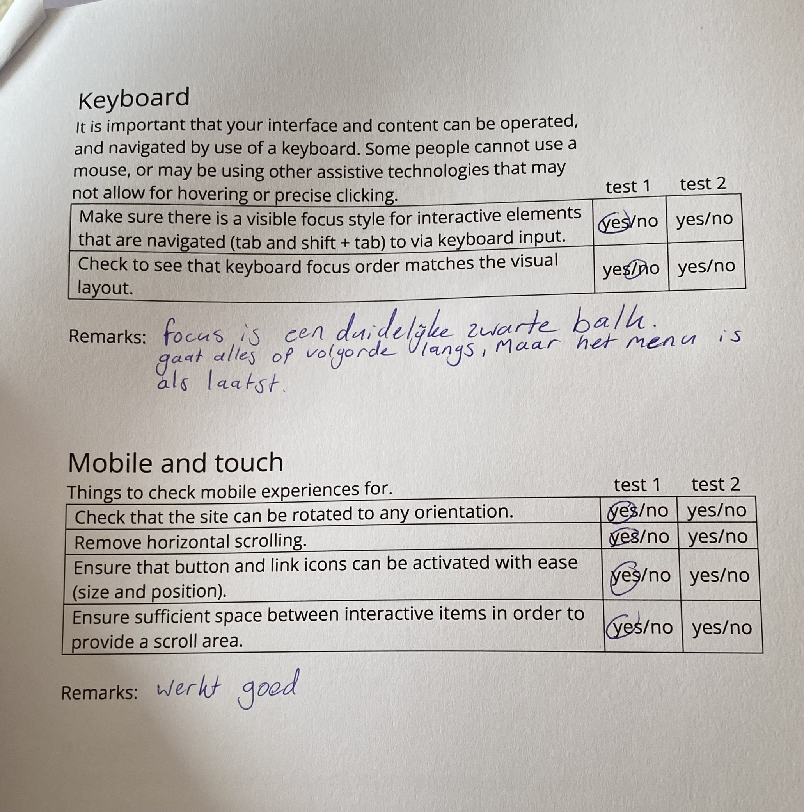
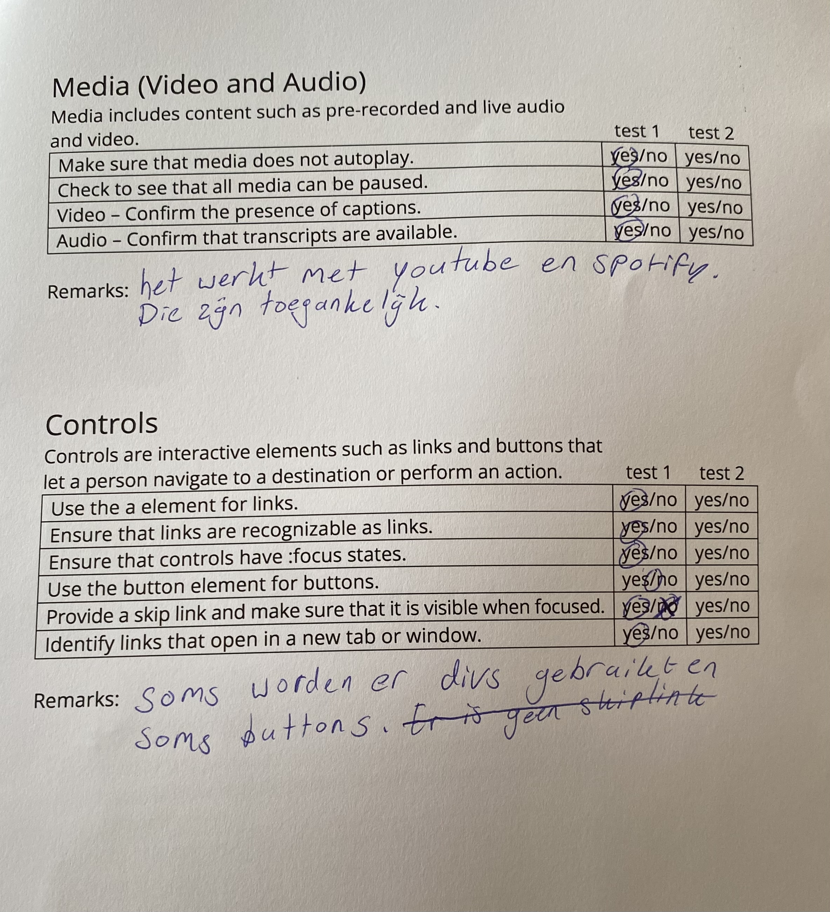
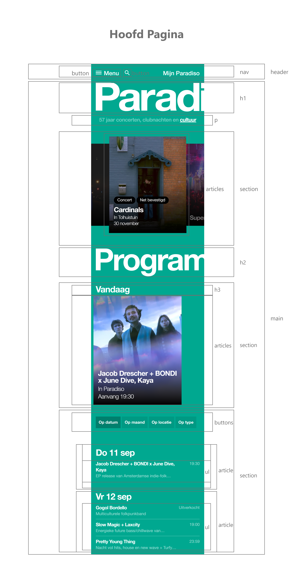

# Procesverslag
Markdown is een simpele manier om HTML te schrijven.  
Markdown cheat cheet: [Hulp bij het schrijven van Markdown](https://github.com/adam-p/markdown-here/wiki/Markdown-Cheatsheet).

Nb. De standaardstructuur en de spartaanse opmaak van de README.md zijn helemaal prima. Het gaat om de inhoud van je procesverslag. Besteedt de tijd voor pracht en praal aan je website.

Nb. Door *open* toe te voegen aan een *details* element kun je deze standaard open zetten. Fijn om dat steeds voor de relevante stuk(ken) te doen.

## Jij

  ### Auteur:
  Mees Bulsing

  #### Je startniveau:
  Rood

  #### Je focus:
  Rersponsivness
 

## Je website

  ### Je opdracht:
  https://www.paradiso.nl/

  #### Screenshot(s) van de eerste pagina (small screen): 
  Paradiso
  

  #### Screenshot(s) van de eerste pagina (big screen): 
  Paradiso
  

  #### Screenshot(s) van het hamburger menu op de eerste pagina (small screen): 
  Paradiso
  \

  #### Screenshot(s) van het hamburger menu op de eerste pagina (big screen): 
  Paradiso
  

  #### Screenshot(s) van de tweede pagina (small screen):
  Webshop 
  

  #### Screenshot(s) van de tweede pagina (big screen):
  Webshop 
  

  #### Screenshot(s) van het hamburger menu op de eerste pagina (big screen): 
  Paradiso
  
 

## Toegankelijkheidstest 1/2 (week 1)

  ### Bevindingen
  Er zitten errors in de html, soms wordt de H1 tag overgeslagen, bijna nooit worden er lists gebruikt en in plaats van lists gebruiken de developers van de Paradiso website heel veel div. Alt teksten mogen soms wat uitgebreider uitgelegd worden en sommige foto's missen de alt text compleet en dan is er ook geen null alt. Door het gebruik van svg's in sommige logo's en teksten werkt high-contrast niet altijd goed. De svg's blijven zwart wanneer de achtergrond dan ook zwart wordt voor high-contrast mode, wat ervoor zorgt dat sommige headings of logo's compleet onleesbaar worden.

  
  
  
  
  

## Breakdownschets (week 1)

  ### de hoofd pagina: 
  

  ### de product pagina: 
  >

## Voortgang 1 (week 2)

  ### Stand van zaken
  Er is nog niet begonnen aan het coderen van de website, maar tot nu toe waren de opdrachten nog te doen. Alle opdrachten lukte mij uiteindelijk wel, soms had ik wel even hulp nodig van de uitwerking de dag erna, maar dan lukte het daarna wel. Behalve bij de carousel opdracht. Ik had heel veel moeite met het toevoegen van de knoppen, dus daar moet ik nog aan werken voordat ik aan mijn website begin.

  ### Agenda voor meeting
  samen met je groepje opstellen

- Mees: ik wil bespreken hoe ik soepele hamburger menu's kan maken en hoe ik die dan verberg als het menu ingeklapt is, ook ben ik benieuwd naar hoe ik werkende buttons en andere effecten aan een carousel toevoeg, met behulp van de hulp website uit de opdracht.

- Sarah

- Sharlainie

- Enia

  ### Verslag van meeting
  hier na afloop snel de uitkomsten van de meeting vastleggen

  - punt 1
  - punt 2
  - nog een punt
  - ...

## Voortgang 2 (week 3)

  
uitwerken voor 2e voortgang

  ### Stand van zaken
  hier dit ging goed & dit was lastig (neem ook screenshots op van delen van je website en code)

  ### Agenda voor meeting
  samen met je groepje opstellen

  | student 1      | student 2          | student 3    | student 4        |
  | ---            | ---                | ---          | ---              |
  | dit bespreken  | en dit             | en ik dit    | en dan ik dat    |
  | en dat ook nog | dit als er tijd is | nog een punt | dit wil ik zeker |
  | ...            | ...                | ...          | ...              |

  ### Verslag van meeting
  hier na afloop snel de uitkomsten van de meeting vastleggen

  - punt 1
  - punt 2
  - nog een punt
- ...

## Toegankelijkheidstest 2/2 (week 4)

  
uitwerken na test in 9e werkgroep

  ### Bevindingen
  Lijst met je bevindingen die in de test naar voren kwamen (geef ook aan wat er verbeterd is):

## Voortgang 3 (week 4)

  
uitwerken voor 3e voortgang

  ### Stand van zaken
  hier dit ging goed & dit was lastig (neem ook screenshots op van delen van je website en code)

  ### Agenda voor meeting
  samen met je groepje opstellen

  | student 1      | student 2          | student 3    | student 4        |
  | ---            | ---                | ---          | ---              |
  | dit bespreken  | en dit             | en ik dit    | en dan ik dat    |
  | en dat ook nog | dit als er tijd is | nog een punt | dit wil ik zeker |
  | ...            | ...                | ...          | ...              |

  ### Verslag van meeting
  hier na afloop snel de uitkomsten van de meeting vastleggen

  - punt 1
  - punt 2
  - nog een punt
  - ...

## Eindgesprek (week 5)

  
uitwerken voor eindgesprek

  ### Je uitkomst - karakteristiek screenshots:
  

  ### Dit ging goed/Heb ik geleerd: 
  Korte omschrijving met plaatjes

  

  ### Dit was lastig/Is niet gelukt:
  Korte omschrijving met plaatjes

  

## Bronnenlijst

  
continu bijhouden terwijl je werkt

  Nb. Wees specifiek ('css-tricks' als bron is bijv. niet specifiek genoeg). 
  Nb. ChatGpT en andere AI horen er ook bij.
  Nb. Vermeld de bronnen ook in je code.

  1. bron 1
  2. bron 2
  3. ...

